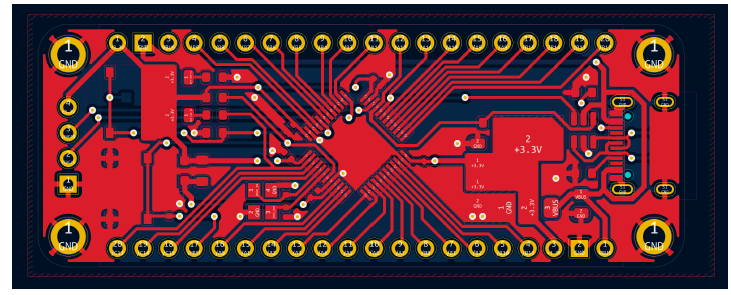
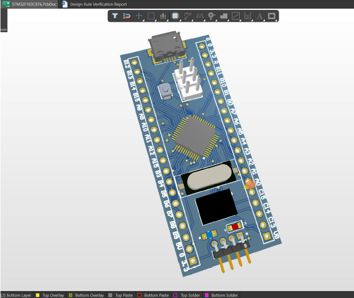
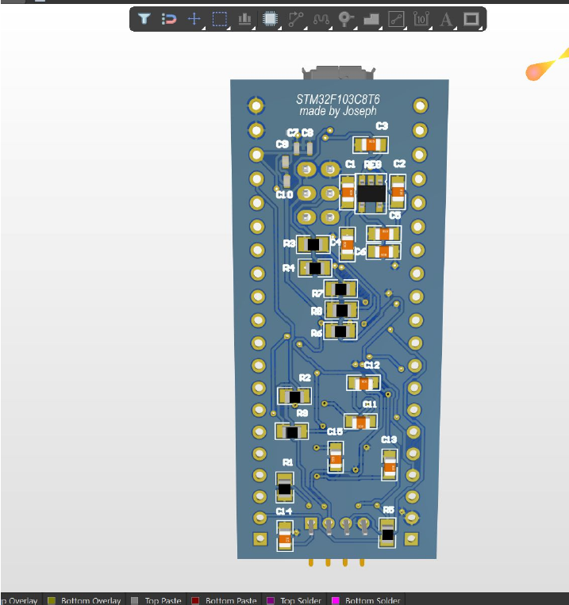
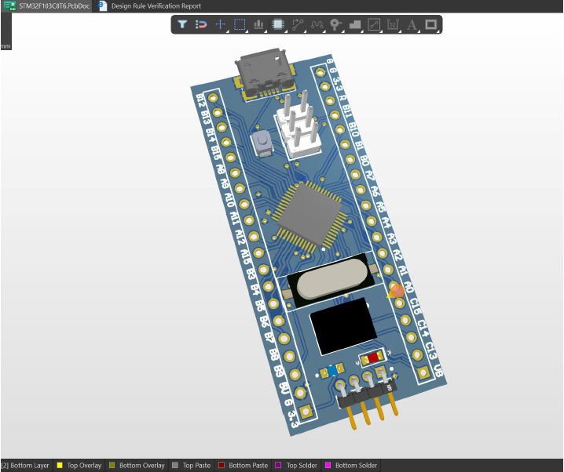
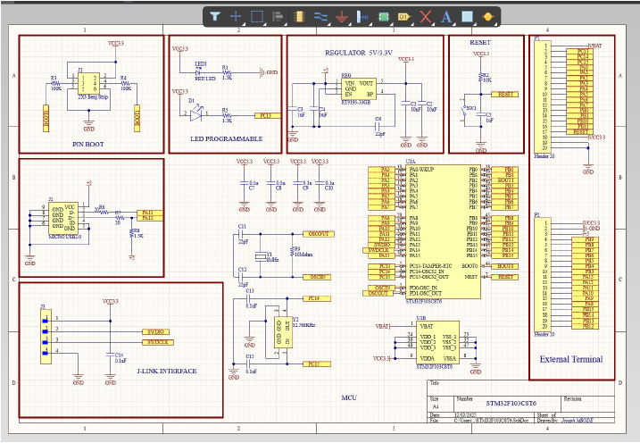
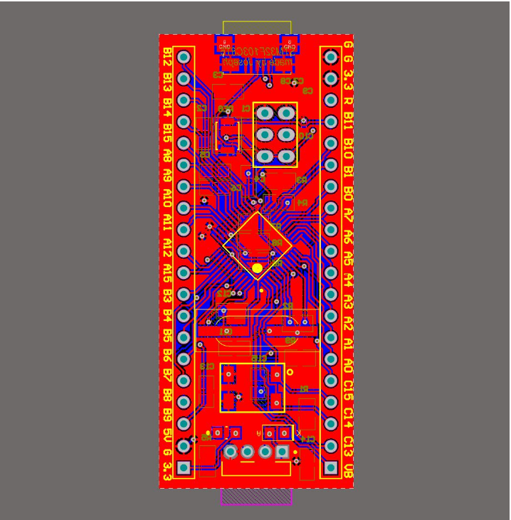
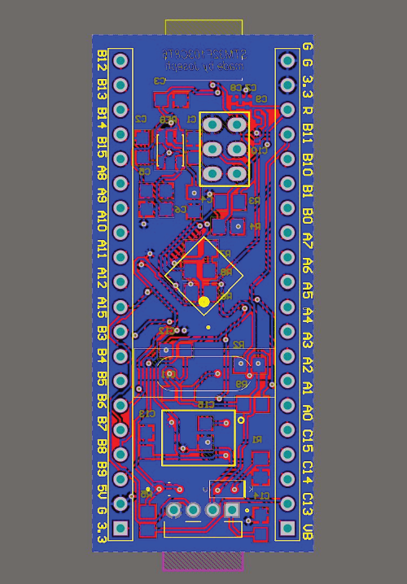
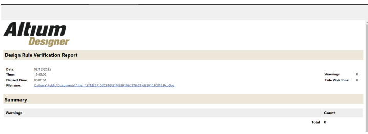

<div align="center">

# Blue Pill STM32F103C8T6 Custom Board

### Schematic capture, 2-layer PCB layout and DRC-clean design in Altium Designer

[](https://www.st.com/en/microcontrollers-microprocessors/stm32f103c8.html)
[](https://www.altium.com/altium-designer)
[](#pcb-layout)
[](#design-rule-verification)

**A from-scratch "Blue Pill"-class development board: USB-powered, SWD-debuggable, every GPIO broken out.**

</div>



## Overview

This project covers the complete design of a development board built around the **STMicroelectronics STM32F103C8T6** (ARM Cortex-M3, 72 MHz, 64 KB Flash, LQFP48), following an industrial PCB workflow:

- schematic capture organised in functional blocks,
- symbol-to-footprint association,
- placement and routing under explicit constraints (clearances, track widths, vias),
- electrical and design-rule verification (ERC / DRC) down to **zero violations**,
- 3D review and preparation of a manufacturable prototype.

The board is intended as a reusable base for future **real-time signal acquisition and processing** work (ADC sampling, EMG filtering, DAC output).

| Parameter | Value |
|---|---|
| Microcontroller | STM32F103C8T6 (Cortex-M3, 72 MHz, LQFP48) |
| Power input | 5 V from Micro-USB (VBUS) |
| System rail | 3.3 V, RT9193-33 LDO |
| Clocks | 8 MHz HSE crystal, 32.768 kHz LSE crystal |
| Debug | 4-pin SWD (J-Link / ST-Link) |
| I/O | 2 x 20-pin headers |
| PCB | 2 copper layers, GND pours on both sides |
| EDA tool | Altium Designer |
| Verification | DRC: 0 violations, 0 warnings |

## System architecture

```text
   Micro-USB 2.0
   ├── VBUS (+5 V) ──► RT9193-33 LDO ──► +3.3 V ──┬──► MCU (VDD x3, VDDA) + 4 x 100 nF
   │                                               ├──► Power LED
   │                                               └──► Header pins
   └── D+ / D- ───────────────────────────┐
                                           ▼
 8 MHz crystal (HSE) ──────────►  ┌──────────────────────┐
 32.768 kHz crystal (LSE) ─────►  │    STM32F103C8T6     │ ──► PC13 user LED
 BOOT0 / BOOT1 jumpers ────────►  │  Cortex-M3 @ 72 MHz  │
 Reset button + RC ────────────►  │                      │ ──► 2 x 20-pin headers
 SWD header (SWDIO, SWCLK) ────►  └──────────────────────┘     (all GPIO)
```

## Board views

The board has not been fabricated yet. All views below come from Altium Designer.

| 3D render, top | 3D render, bottom | 3D render, alternate view |
|---|---|---|
|  |  |  |
| MCU, crystals, Micro-USB, BOOT jumpers, SWD header | Passives, LDO and silkscreen | Second angle of the assembled board |

## Schematic



The main schematic (`STM32F103C8T6.SchDoc`) is split into bounded functional blocks:

| Block | Key components | Role |
|---|---|---|
| **Regulator 5 V / 3.3 V** | RT9193-33GB LDO, 1 µF and 10 µF ceramics, 22 pF on BP pin | 3.3 V system rail from USB VBUS |
| **MCU** | STM32F103C8T6 (U1A / U1B), 4 x 100 nF decoupling | Core, one capacitor per supply pin |
| **HSE clock** | 8 MHz crystal Y1, 2 x 22 pF load capacitors | Main clock, PLL up to 72 MHz |
| **LSE clock** | 32.768 kHz crystal Y2 | RTC |
| **Pin boot** | 2x3 pin strip, 2 x 100 kΩ pull-downs | BOOT0 / BOOT1 mode selection |
| **Reset** | Push-button SW1, 10 kΩ pull-up, 1 µF | NRST with RC filtering |
| **USB** | Micro-USB 2.0, series resistors on D+/D-, 1.5 kΩ D+ pull-up | USB Full-Speed device (PA11 / PA12) |
| **J-Link interface** | 4-pin SWD header, 100 nF | Programming and debug |
| **LEDs** | Red power LED, user LED on PC13, 1.5 kΩ each | Status indication |
| **External terminal** | Header P1 / P2 (20 pins each) | Breadboard-compatible GPIO access |

### Design notes

**Crystal load capacitance.** With two 22 pF capacitors, the load seen by the 8 MHz crystal is:

$$
C_L = \frac{C_{11} \cdot C_{12}}{C_{11} + C_{12}} + C_{stray} \approx 11\ \text{pF} + C_{stray}
$$

**LDO dissipation.** The linear regulator drops 1.7 V and dissipates:

$$
P_{LDO} = (V_{IN} - V_{OUT}) \cdot I_{LOAD} = 1.7\ \text{V} \cdot I_{LOAD}
$$

## PCB layout

| Top layer | Bottom layer |
|---|---|
|  |  |

Placement strategy:

1. MCU centred to keep fan-out short on all four sides.
2. Crystals placed next to the OSC pins, load capacitors as close as possible.
3. One 100 nF decoupling capacitor per VDD pin.
4. Micro-USB and SWD on the board edges, headers on both long sides.
5. GND pours on top and bottom, stitched with vias.

## Design workflow

```text
Schematic ──► ERC ──► Footprints ──► Placement ──► Routing (2 layers + GND pours)
    ▲                                                        │
    │                                                        ▼
SCH ↔ PCB cross-check ◄──────────── DRC iterations ◄─────────┘
                                         │
                                         ▼
                        0 violations ──► 3D review ──► Fabrication outputs
```

## Design rule verification



| Check | Result |
|---|---|
| Rule violations | **0** |
| Warnings | **0** |
| Report date | 02/12/2025 |

Full Altium report: [`Design Rule Check - STM32F103C8T6.html`](Project%20Outputs%20for%20STM32F103C8T6/Design%20Rule%20Check%20-%20STM32F103C8T6.html)

The last violation to fix was a clearance issue between the **GND** net and a pad of **U1**, solved after locating it precisely from the report.

## Hardware bring-up

| Test | Status |
|---|---|
| PCB fabrication | Not yet done |
| 3.3 V rail measurement | TBD |
| SWD connection and flashing | TBD |
| HSE / LSE oscillation | TBD |
| USB enumeration | TBD |
| PC13 blink test | TBD |

No measurement is reported because the board has not been manufactured yet. This section will be updated after bring-up.

## Repository structure

```text
.
├── assets/
│   └── images/
│       ├── drc_report_0_violations.png
│       ├── pcb_2d_bottom_layer.png
│       ├── pcb_2d_top_layer.png
│       ├── pcb_3d_bottom_view.png
│       ├── pcb_3d_bottom_view_2.png
│       ├── pcb_3d_top_view.png
│       ├── pcb_top_copper_banner.png
│       └── schematic_full.png
├── Project Outputs for STM32F103C8T6/
│   ├── Design Rule Check - STM32F103C8T6.drc
│   └── Design Rule Check - STM32F103C8T6.html
├── .gitignore
├── README.md
├── Sheet1.SchDoc
├── STM32F103C8T6.PcbDoc
├── STM32F103C8T6.PrjPcb
└── STM32F103C8T6.SchDoc
```

Open `STM32F103C8T6.PrjPcb` in Altium Designer to load the full project.

## Limitations and future work

**Limitations**

- Board not yet fabricated, so no electrical validation on real hardware.
- No ESD protection on USB data lines, no protection on VBUS.
- USB D+/D- routed without impedance control (acceptable at Full-Speed on short traces, not verified).

**Lessons learned**

- Reading DRC reports precisely saves more time than re-routing globally.
- A strict analyse, fix, re-verify loop converges fastest.
- Keeping schematic and PCB in sync avoids silent net mismatches.

**Next steps**

- [ ] Generate Gerber, drill, BOM and Pick & Place files and order the PCB
- [ ] Assemble the board and run the bring-up checklist
- [ ] Add a USB TVS array and a VBUS protection diode
- [ ] Write minimal firmware (STM32CubeIDE / HAL): blink, UART, ADC
- [ ] Use the board as an acquisition front-end for EMG filtering and real-time DSP

## Skills

Altium Designer · Schematic capture · PCB layout · DRC / ERC · STM32 hardware design · Clock and power design · USB and SWD interfaces · 3D board review

## Author

**Joseph Mbode**

Embedded systems engineer, electronics and PCB design.

- LinkedIn: [Joseph Mbode](https://www.linkedin.com/in/joseph-mbode)
- GitHub: [@Josephulrich](https://github.com/Josephulrich)
